# 灵动的线条

**记录时间：** 2019-10-11

## 课程导学

#### 学习目标

掌握素描线条定义和排线方法、姿势

## 拿笔姿势

上节课讲过，三角式和上握式

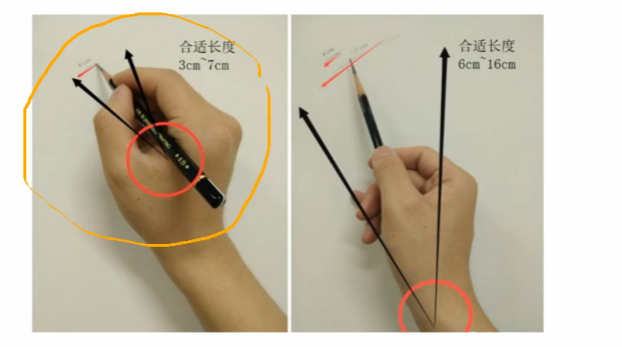

### 三角式

受力点在手腕，长度比较短，适合刻画精细的地方

### 手持式

受力点在肩，画得长度比较长，半径比较长

## 排线技巧

### 排线目的

加强物体质感

### 线的用法

笔到纸，从远到近再到远，两头轻中间重

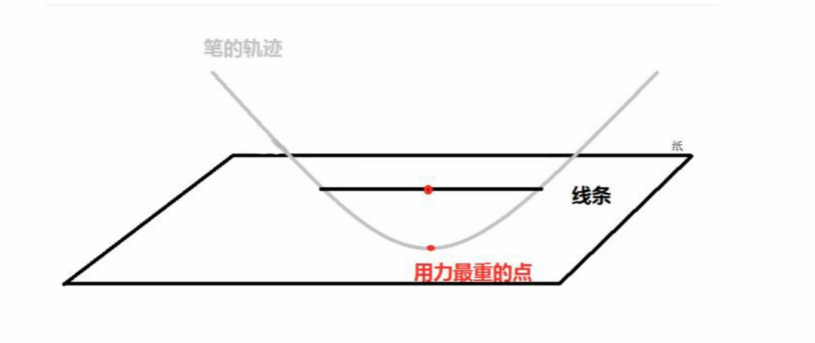

### 颜色色调

不同硬度黑度，色阶出来不一样，亮部用硬铅

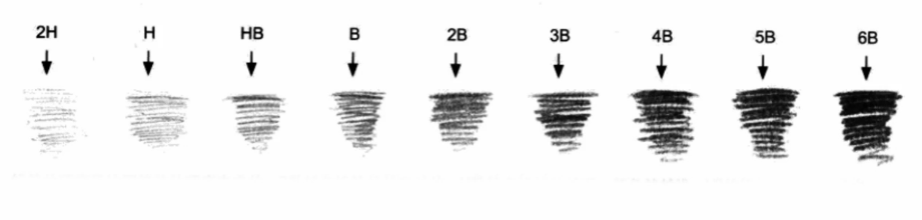

画色阶的时候，色块+渐变

上握式肩膀受力时，手腕不能弯

即使用12B也能画出HB的效果，但是不同的笔有不同的作用，比如HB适合刻画细节，更尖更细

### 平行直线

打长直线的时候 肩膀用力，一笔坚定的打下去

或者用复线的方式也可以达到长直线的效果

### 斜向平行线

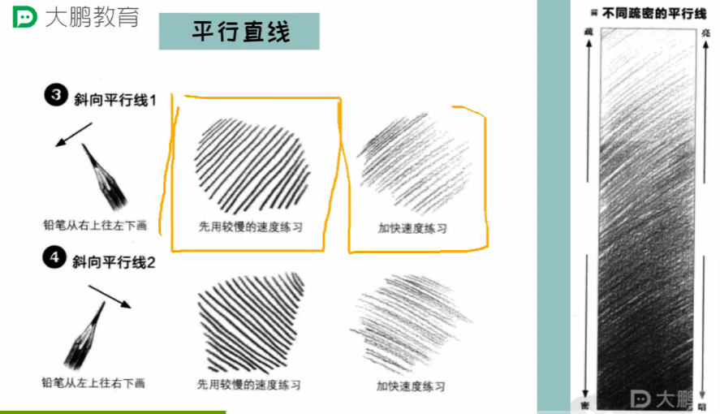

用力方式和姿势很重要

### 直线的虚实变化

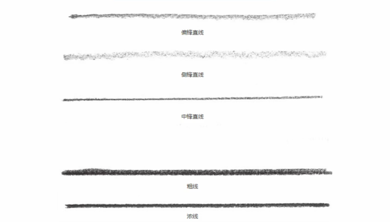

偏锋直线是用笔尖和侧锋画出来的，上边是直的，下边有浅锋，适合画明暗交界线

侧锋直线，纯侧锋，没有上边的直线，更浅，缺少线条感

中锋直线，笔抬起来，笔尖离纸面差不多70度，效果更尖

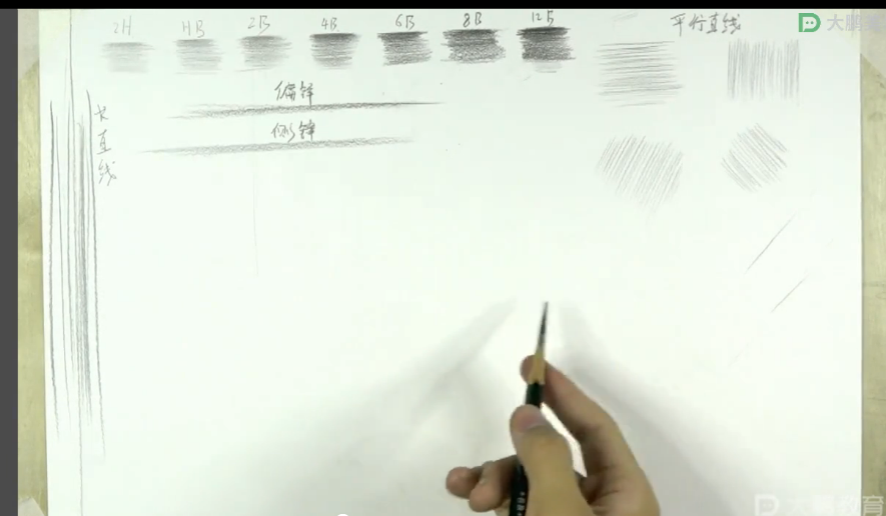

粗线，与侧锋有点类似，但是特点是浓，粗，适合平铺颜色

复线，画很多次出来的效果

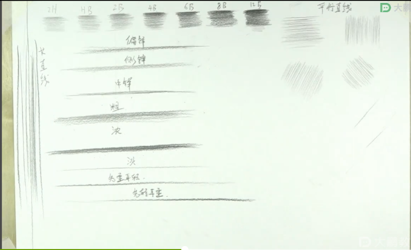

### 交叉直线

画交叉直线，好填充，网格线不好填充

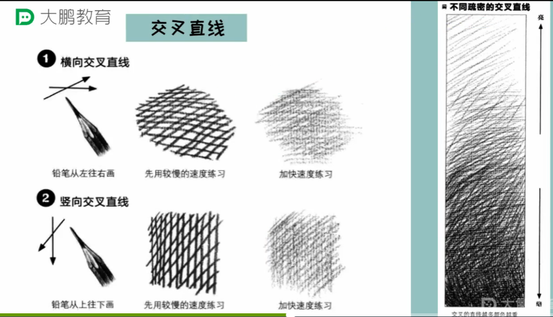

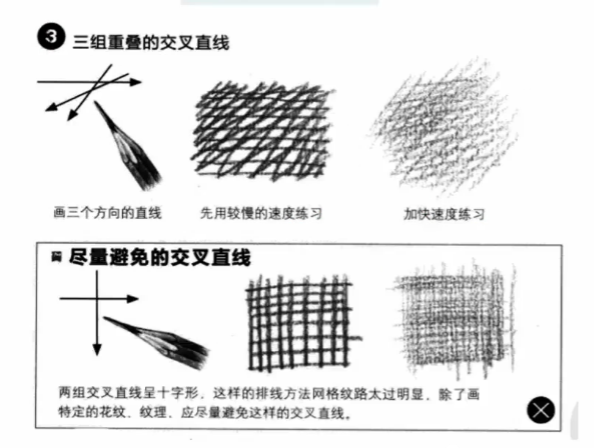

线条有轻重变化，可以产生立体感

### 弧线

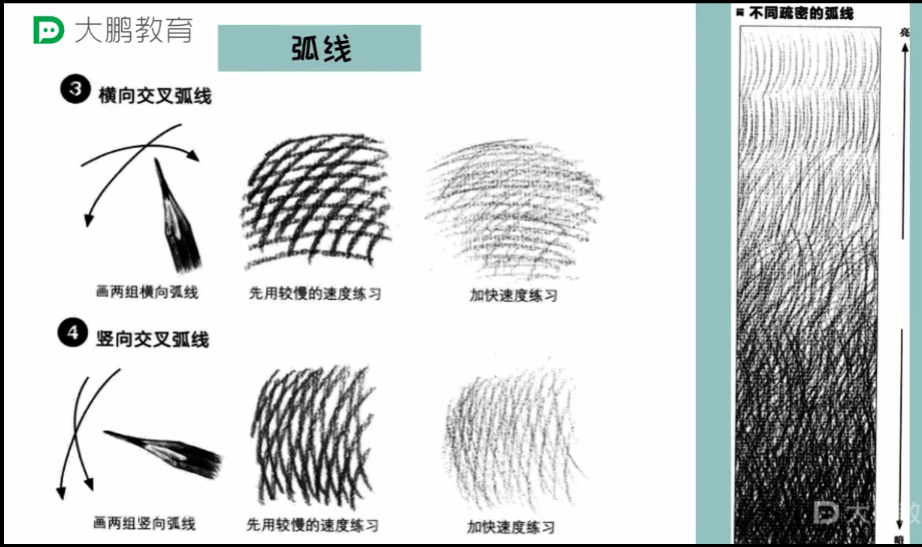

### 短线

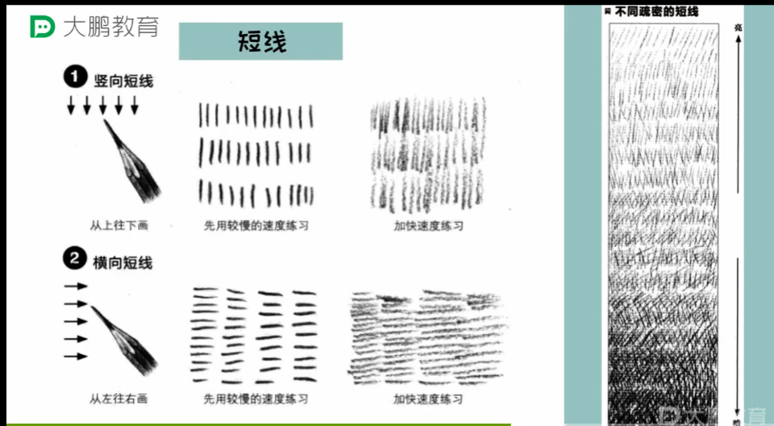

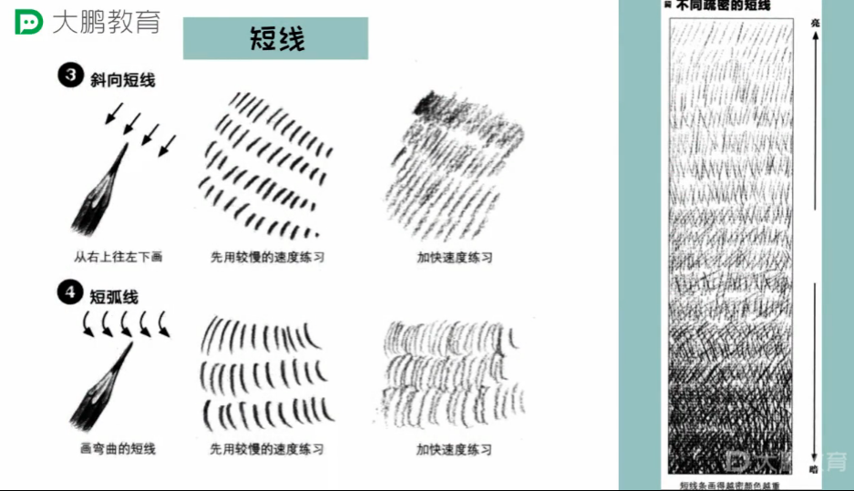

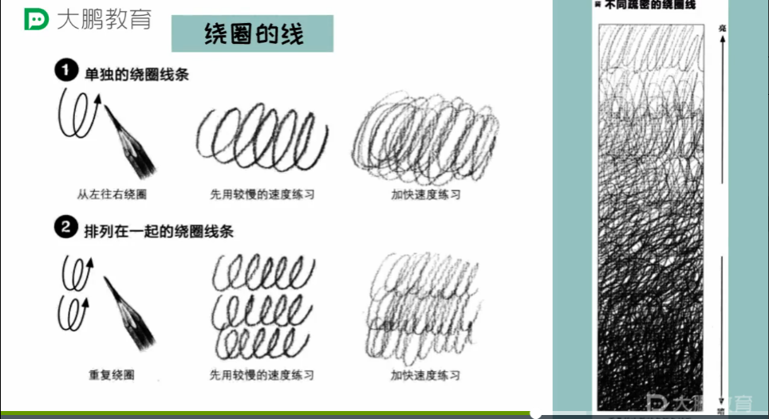

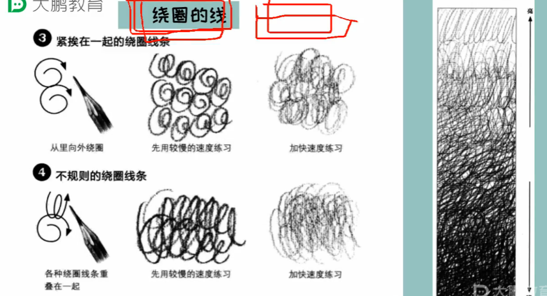

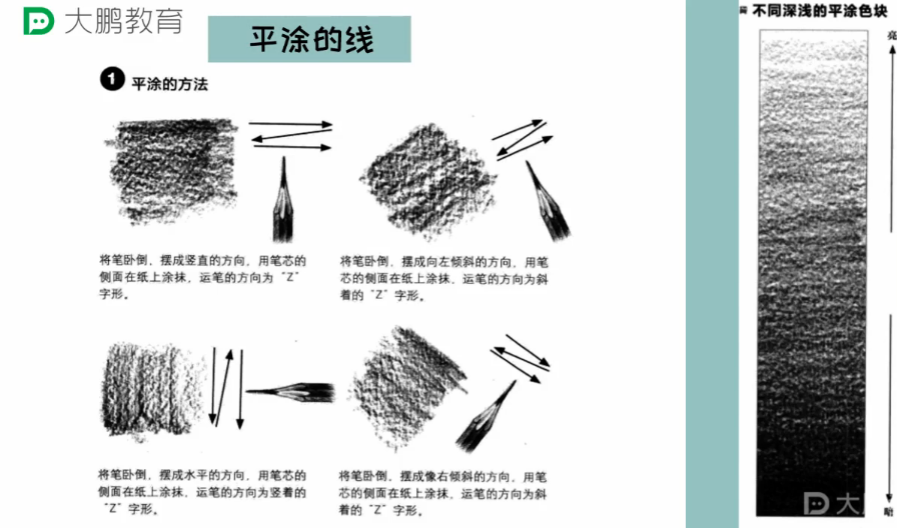

## 根据结构排调子

线条的排列方式代表着体积，更好的区分出来线条

顺着结构排线表现肌理，两边重，中间浅，有立体突出的效果，两边冷中间暖同理。

### 刻画一个正方体

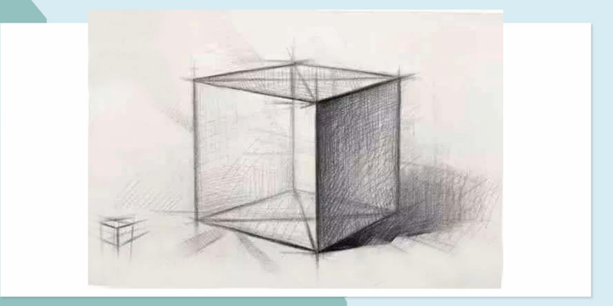

右侧面：上边重下边浅

明暗交界线：右上线+中间线

## 作业

照着老师的，练习画线条

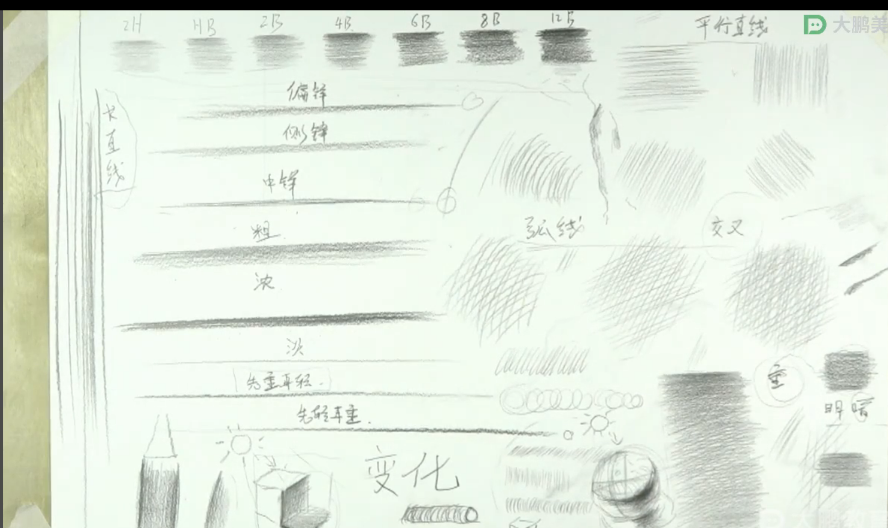

## 总结

- 排线是为了加强物体质感
- 根据接口排线可以更有立体感，更好的区分线条
- 不同硬度和黑度，能够出来不同的效果
- 偏锋（笔尖+侧锋，常用于明暗交界线）侧锋和中锋