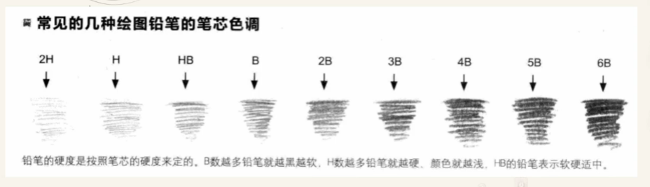
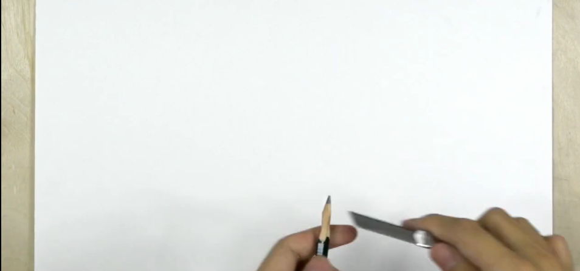
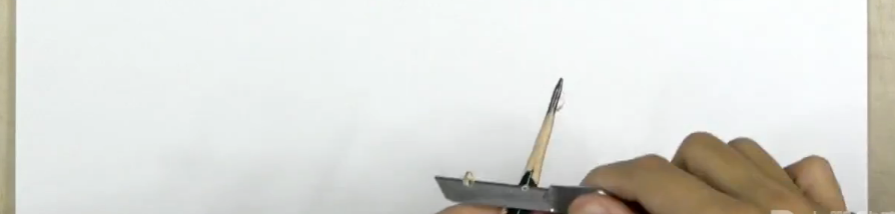
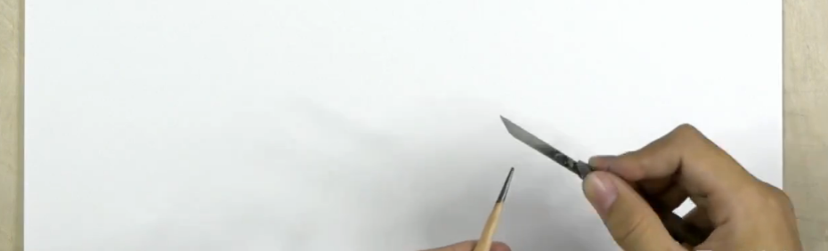

# 素描工具

## 课程导学

#### 学习目标

掌握技法理论，掌握工具种类、使用方法，规范作画姿势

## 素描工具

### 四个重点

- 笔的型号和种类
- 纸张与画本
- 橡皮的种类和使用方法
- 辅助工具和作画姿势

### 认识笔

#### 铅笔

> 主要材料是石墨

##### 铅笔的型号

6H-4H-2H-H-HB-B-2B-4B-6B-8B-12B

##### H和B的区别

H = hard 硬度，B = black 黑度

H数越多笔越硬颜色越浅，适合亮面的浅灰和细节

B数越多笔越黑越软，颜色越深容易上色

##### 品牌

中华、马利、三菱

尽量选偶数B

##### 如何削铅笔

第一步，露出铅芯

- 削菱形面，一层一层的转动着削，均衡受力

- 拇指推动刀子
- 刮白平滑不扎手

第二步，刮铅

- 左右两边刮，旋转一点点刮，笔尖一点点变细

#### 炭笔

> 以炭精做笔芯的木杆笔，不宜反光，容易出效果，容易削断

分软中硬三种，有马利和马克等

#### 木炭条

> 大多由柳树的细枝烧纸，容易断

#### 索斯

> 俄罗斯特有，主要成分为石墨