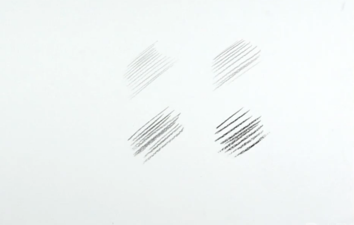
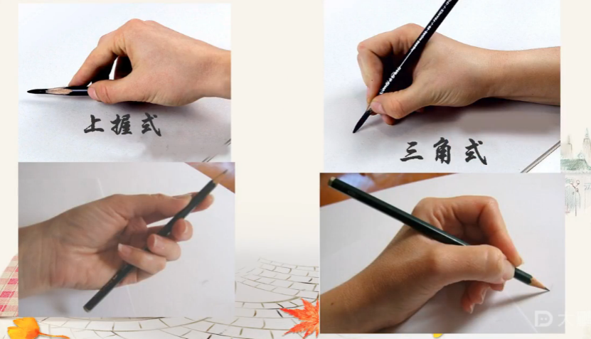
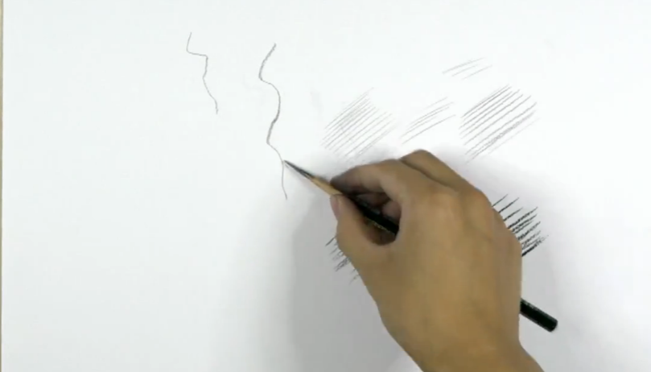
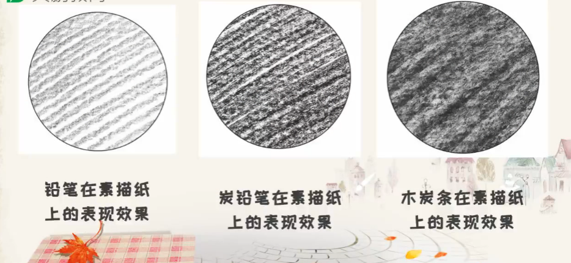
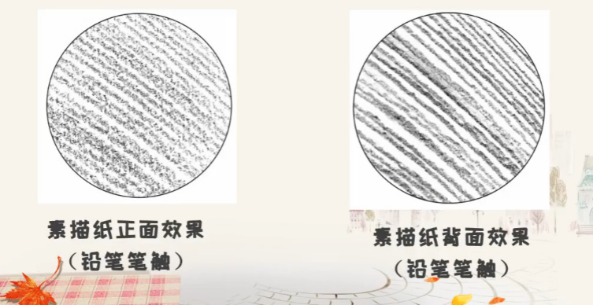
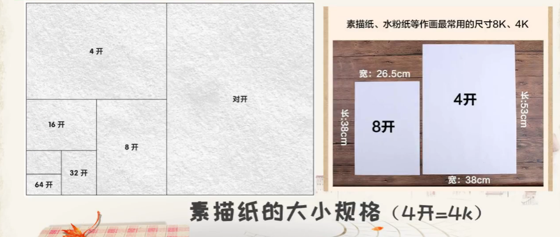
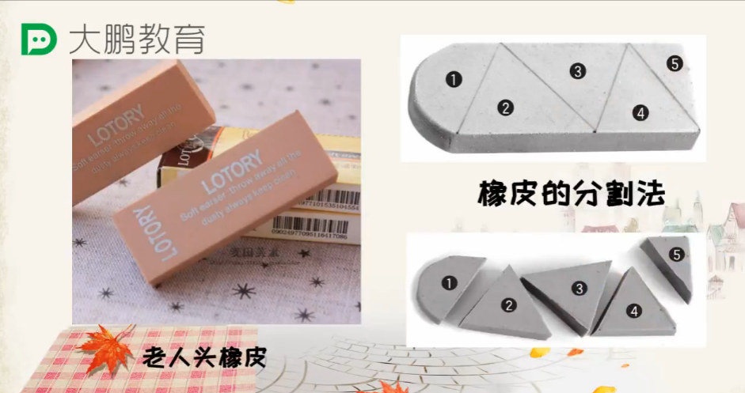
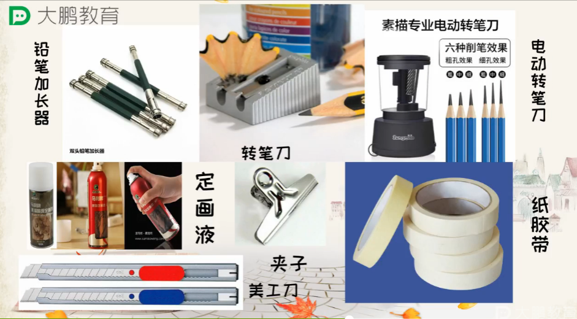
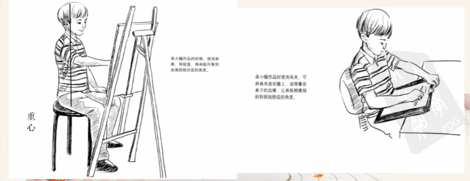

# 素描工具

**记录时间：** 2019-10-11

## 课程导学

#### 学习目标

掌握技法理论，掌握工具种类、使用方法，规范作画姿势

## 素描工具

### 四个重点

- 笔的型号和种类
- 纸张与画本
- 橡皮的种类和使用方法
- 辅助工具和作画姿势

### 认识笔

#### 铅笔

> 主要材料是石墨

##### 铅笔的型号

6H-4H-2H-H-HB-B-2B-4B-6B-8B-12B

##### H和B的区别

H = hard 硬度，B = black 黑度

H数越多笔越硬颜色越浅，适合亮面的浅灰和细节

B数越多笔越黑越软，颜色越深容易上色

##### 品牌

中华、马利、三菱

尽量选偶数B

##### 如何削铅笔

第一步，露出铅芯

- 削菱形面，一层一层的转动着削，均衡受力

- 拇指推动刀子
- 刮白平滑不扎手

第二步，刮铅

- 左右两边刮，旋转一点点刮，笔尖一点点变细

#### 炭笔

> 以炭精做笔芯的木杆笔，不宜反光，容易出效果，容易削断

分软中硬三种，有马利和马克等

#### 木炭条

> 大多由柳树的细枝烧纸，容易断

#### 索斯

> 俄罗斯特有，主要成分为石墨

#### 笔刷效果

从左上到右下，4B铅笔，中性炭笔，木炭条，索斯

### 握笔姿势

#### 上握式

大拇指握住平面，可以中指无名指小指做支撑

可以画出线条的粗细

#### 三角式

画粗细均匀的线条

### 纸张和画本

#### 素描纸

分素描纸、速写纸等

#### 纸的刻数

刻数越高越厚

#### 纸的纹理

分为细纹、中纹、粗糙

#### 纸的颜色

白纸黄纸，白色对比度较强，黄色会将颜色统一

#### 表现效果

#### 正反面的区分

正面粗糙，反面光滑；纹理越粗，吃铅能力越强，容易上色，有颗粒感。

#### 纸的大小规格

### 橡皮的种类

#### 硬橡皮

擦高光等作用，主要是用棱角做精细的擦除

#### 软橡皮

擦灰面，也可用纸巾代替

### 画架

实木画架稳重

折叠画架不稳轻便

### 画板

放平，稳定，画纸不乱动

### 速写板

轻便小巧

### 其他工具

### 姿势

重心垂直座位，眼平视垂直于画面，不然透视不准，看画布也会透视

## 总结

- 铅笔分H和B，意思分别为硬度和黑度，初学可以用中华牌铅笔
- 握笔姿势分为上握式和三角式，用于轻重不同的线以及排线
- 素描纸以刻度衡量厚度，越大越厚，正面较粗糙，反面较光滑，颜色有白有黄，白色高对比，黄色更柔和，大小分2K到64K，一般素描用8到4K
- 橡皮分硬橡皮、软橡皮、可塑橡皮，推荐老人头
- 画架分木制和折叠，一个稳重，一个轻便
- 画板用于放平纸张，较大较重，速写版比较轻便适合小型纸张
- 坐姿很重要，不然容易因为透视而画偏，眼睛平视垂直于画面，画画的区域尽可能移到视线平视垂直下方。