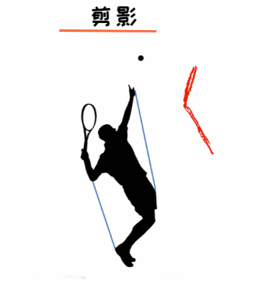
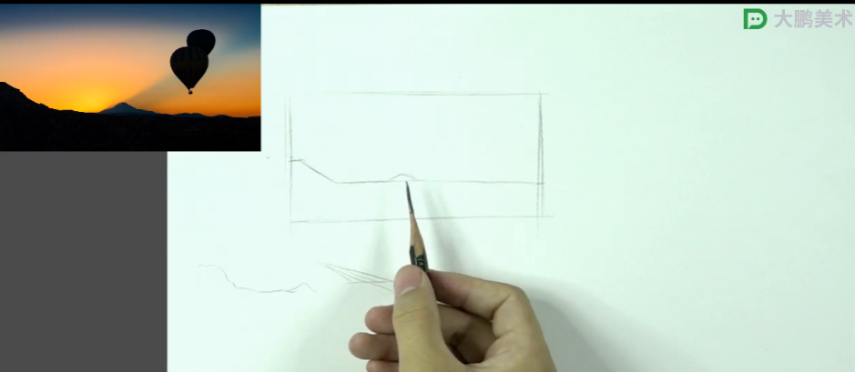
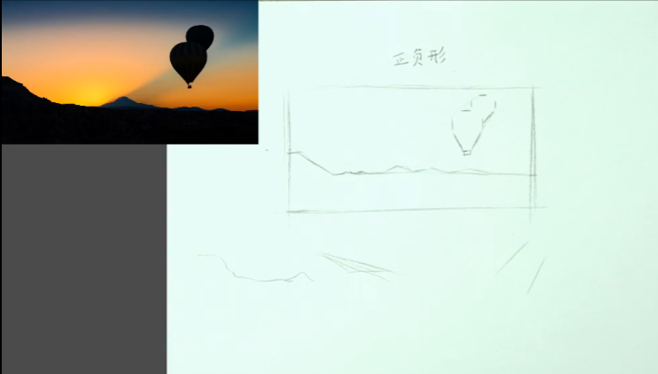
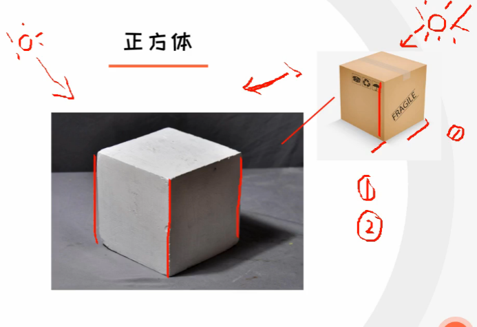
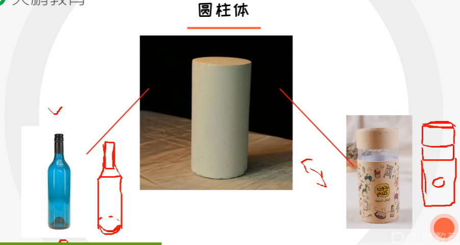
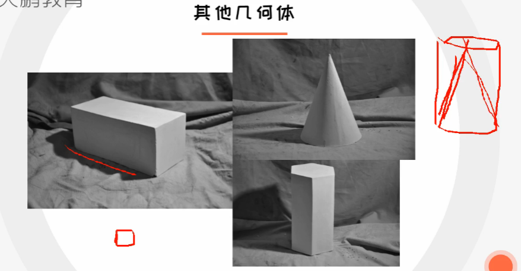
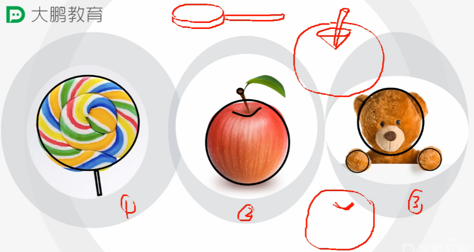
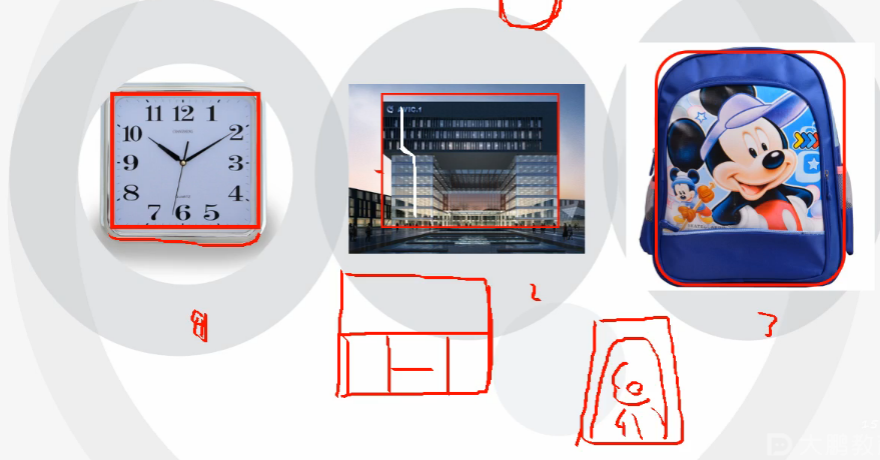

# 观察与概括

**记录时间：** 2019-10-16

## 课程导学

#### 学习目标

掌握素描政府性、概括法、测量法

## 剪影与正负

黑色与白色互为正负型，白色正形，黑色负型，白色较为阳光，黑色较为黑暗

鲁宾杯正负型相互呼应，互不分离

### 剪影

结合负型，用于检查起型是否准确

####  起型方法

##### 第一步

按照直线的方式，给整体概括出来，首先得把位置找对，把正负型找对

把细节部分进行细微变化，用高光橡皮擦除后重绘

##### 第二步

画球的时候，把两侧宽找出来，再找长，最后找顶点

##### 第三步

完善细节即可

## 几何体概括法

通过几何把形体概括起来，观察外轮廓，再细化里边的东西

### 实物拆分

## 物体测量法